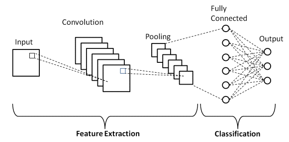
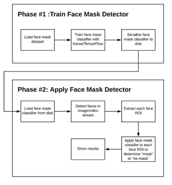
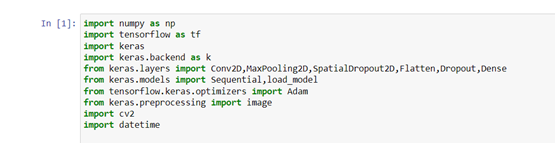
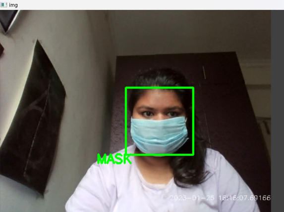

# Real-Time-Face-Mask-Detection

The main objective of the face detection model is to detect the face of individuals (face detection) and determine whether they are wearing masks in real-time using a webcam.

## Methodology

### Technique used for face mask detection

- **Convolutional Neural Network (CNN):** A deep learning model for image classification.
- **TensorFlow and Keras:** Machine learning libraries used to build and train the model.
- **OpenCV:** Used for real-time image processing and face detection.

### Two-phase Face Mask Detector

To train a custom-made face mask detector, we need to divide our project into two phases:

1. **Training:** Load the dataset (Mask and No Mask) and train a CNN model using TensorFlow/Keras.
2. **Deployment:** Load the mask detector prediction model, perform face detection, and classify each face as "Mask" or "No Mask."

### Algorithm

We use various libraries, including:

- **OpenCV:** For real-time image processing and face detection.
- **TensorFlow:** A platform for machine learning.
- **Keras:** A deep learning API.

## Result and Discussion

### Result

Our face mask detection model uses a live webcam feed to perform real-time face detection and mask detection. The model can detect if a person is wearing a mask or not with high accuracy.

### Discussion

We can further enhance the model by adding features like contactless temperature checks and identifying mask types. This project has potential for use in various fields to help enforce safety guidelines.

### Conclusion

We've developed a deep learning model for face mask recognition using Python, TensorFlow, Keras, and OpenCV. The model can help detect whether people are wearing masks, which is essential for implementing safety guidelines.

## Credits

This project is based on the work of [Karan Malik](https://github.com/Karan-Malik) and their project [FaceMaskDetector](https://github.com/Karan-Malik/FaceMaskDetector). 

## License

This project is licensed under the [MIT License](LICENSE).
